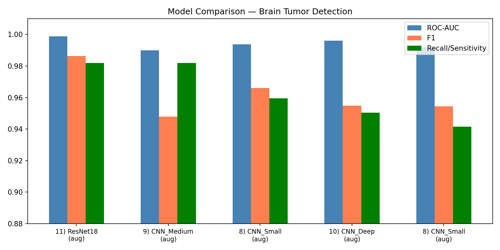
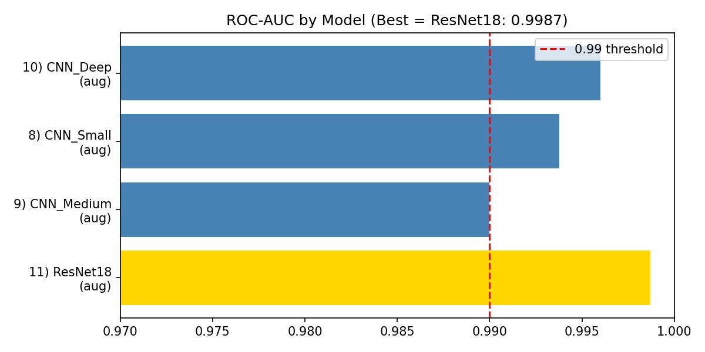
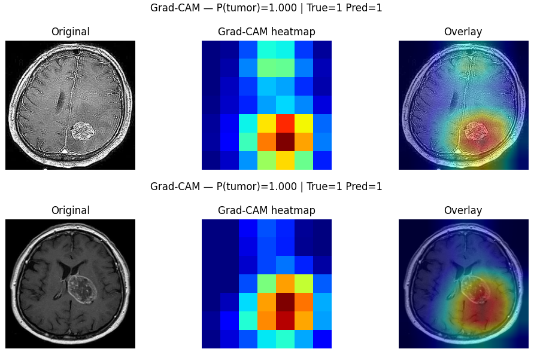

# 🧠 Brain Tumor Detection — End-to-End Medical Image Classification

> Binary classification of brain MRI scans using PyTorch, ResNet18 transfer learning, and Grad-CAM explainability.  
> **Best model: ResNet18 — ROC-AUC 0.9987 | Accuracy 98.6%**

---

## 📌 Overview

This project implements a production-minded deep learning pipeline to detect brain tumors from MRI images. Built as part of the MSc in Artificial Intelligence Systems at EPITA Paris, it goes beyond basic model training to include data quality checks, deduplication-safe evaluation, multi-architecture comparison, and visual explainability via Grad-CAM.

---

## 🎯 Results

| Model | Accuracy | ROC-AUC | F1 | Recall (Sensitivity) | Specificity |
|---|---|---|---|---|---|
| **ResNet18 (aug)** ⭐ | **98.6%** | **0.9987** | **0.9864** | **0.9820** | **0.9913** |
| CNN_Deep (aug) | 95.6% | 0.9960 | 0.9548 | 0.9505 | 0.9610 |
| CNN_Small (aug) | 96.7% | 0.9938 | 0.9660 | 0.9595 | 0.9740 |
| CNN_Medium (aug) | 94.7% | 0.9900 | 0.9478 | 0.9820 | 0.9134 |

> ✅ ResNet18 transfer learning outperforms all custom CNN architectures across every metric.

---

## 📊 Visualizations

### Model Comparison — ROC-AUC, F1 & Recall


### ROC-AUC by Model


### Grad-CAM Explainability
Grad-CAM heatmaps highlight the regions of the MRI scan that most influenced the model's prediction — critical for clinical trust and interpretability.



---

## 🗂️ Dataset

- **Source:** [Brain Tumor Detection Dataset](https://www.kaggle.com/datasets/navoneel/brain-mri-images-for-brain-tumor-detection)
- **Size:** 3,000 MRI images — 1,500 tumor (`yes`) / 1,500 no-tumor (`no`)
- **Task:** Binary classification (`yes` = tumor = 1, `no` = no tumor = 0)
- **Format:** JPEG images of varying sizes, preprocessed to 224×224

## 📚 Dataset Attribution

**Brain MRI Images for Brain Tumor Detection**  
- **Source:** Kaggle — Navoneel Chakrabarty  
- **Link:** https://www.kaggle.com/datasets/navoneel/brain-mri-images-for-brain-tumor-detection  
- **Size:** 3,000 MRI images (1,500 tumor / 1,500 no-tumor)  
- **License:** Public dataset, freely available on Kaggle  

> Dataset was provided as part of the Image Processing course  
> at EPITA Paris (MSc AI Systems, Semester 3).

---

## 🏗️ Pipeline Architecture

```
Raw MRI Images
      │
      ▼
1. Data Quality Checks
   ├── Corrupt file detection
   └── Near-duplicate detection (perceptual hashing)
      │
      ▼
2. Dedup-Safe Group Split
   └── Ensures near-duplicates don't leak across train/test
      │
      ▼
3. EDA + OpenCV Preprocessing
   ├── Pixel distribution analysis
   ├── Orientation correction (EXIF)
   └── Augmentation pipeline (flip, rotate, color jitter)
      │
      ▼
4. Model Training (5 architectures)
   ├── CNN_Small (custom)
   ├── CNN_Medium (custom)
   ├── CNN_Deep (custom)
   ├── ResNet18 (transfer learning) ⭐
   └── All with Early Stopping
      │
      ▼
5. Evaluation
   ├── Accuracy, F1, Recall, Specificity
   ├── ROC-AUC, PR-AUC
   └── Confusion matrix
      │
      ▼
6. Explainability
   └── Grad-CAM (implemented from scratch with PyTorch hooks)
```

---

## 🔧 Tech Stack

| Category | Tools |
|---|---|
| Deep Learning | PyTorch, torchvision |
| Image Processing | OpenCV, PIL |
| Classical ML | scikit-learn |
| Data | NumPy, Pandas |
| Visualization | Matplotlib |
| Environment | Google Colab (GPU: L4) |

---

## ✨ Key Engineering Decisions

### 1. Dedup-Safe Group Split
Near-duplicate images are grouped before splitting, so no group spans both train and test sets. This prevents data leakage and ensures evaluation metrics are trustworthy — a common mistake in medical imaging benchmarks.

### 2. Multiple Architecture Comparison
Rather than training a single model, the pipeline systematically compares 4 CNN depths plus ResNet18, with a full 21-metric comparison table exported to CSV. This shows that transfer learning consistently outperforms custom architectures on this dataset size.

### 3. Grad-CAM from Scratch
Grad-CAM is implemented manually using PyTorch forward and backward hooks — not imported from a library. This allows full control over target layer selection and produces heatmap overlays that show exactly which MRI regions drove each prediction.

### 4. Data Augmentation Study
Each architecture is evaluated with and without augmentation, providing a controlled comparison of augmentation's impact on generalization. Results confirm augmentation consistently improves recall (sensitivity), which is critical in medical diagnosis contexts.

---

## 🚀 How to Run

### 1. Clone the repository
```bash
git clone https://github.com/gayathri-pamuluru/brain-tumor-detection.git
cd brain-tumor-detection
```

### 2. Install dependencies
```bash
pip install -r requirements.txt
```

### 3. Open the notebook
```bash
jupyter notebook Brain_Tumor_Detection_Project_Submission.ipynb
```
Or open directly in [Google Colab](https://colab.research.google.com/).

### 4. Dataset setup
Download the dataset from Kaggle and place it in:
```
data/
├── yes/   # tumor positive MRI images
└── no/    # tumor negative MRI images
```

---

## 📁 Repository Structure

```
brain-tumor-detection/
│
├── Brain_Tumor_Detection_Project_Submission.ipynb  # Main notebook
├── requirements.txt
├── README.md
│
├── assets/                         # Visualizations for README
│   ├── model_comparison.png
│   ├── roc_auc_comparison.png
│   └── gradcam_example.png
│
└── outputs/                        # Saved during training
    ├── model_comparison_full_metrics.csv
    └── tumor_models/               # Best model checkpoints (.pt)
```

---

## 🧠 Clinical Relevance

In medical AI, **sensitivity (recall)** is the most critical metric — missing a tumor (false negative) is far more dangerous than a false positive. The best model achieves:

- **Sensitivity: 98.2%** — only 4 missed tumors out of 222 positive cases
- **Specificity: 99.1%** — very low false alarm rate

The Grad-CAM overlays provide visual justification for each prediction, supporting clinical interpretability requirements.

---

## 👩‍💻 Author

**Gayathri Pamuluru**  
MSc in Artificial Intelligence Systems — EPITA Paris  
📧 pamulurugayathri@gmail.com  
🔗 [LinkedIn](https://linkedin.com/in/gayathri-pamuluru) | [GitHub](https://github.com/gayathri-pamuluru)

---


